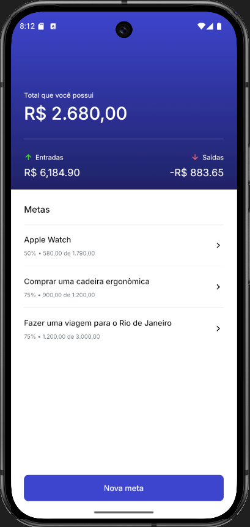
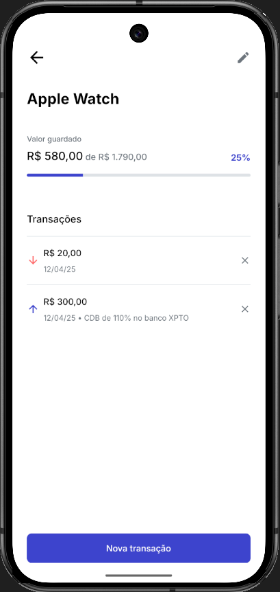
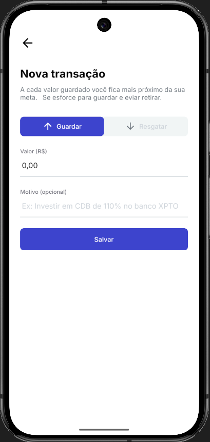
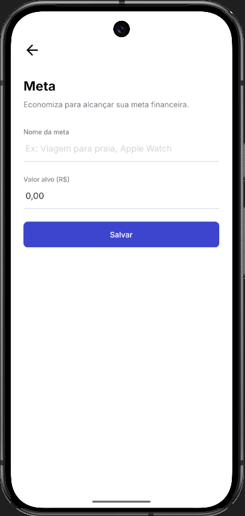

# 🎯 Target — Controle de Metas e Finanças

> Aplicativo mobile para controle de metas financeiras, criado em React Native. Permite criar metas, registrar transações (entrada/saída) e acompanhar o progresso de cada objetivo.

---

## 📋 Sumário

- [Funcionalidades](#-funcionalidades)
- [Screenshots](#-screenshots)
- [Instalação e execução](#-instalação-e-execução)

---

## ✨ Funcionalidades

- 📌 **Listagem de metas** com total de entradas e saídas.
- 📊 **Detalhes da meta**: histórico de transações e progresso em porcentagem/valor.
- ➕ **Cadastrar nova transação** (entrada ou saída) associada a uma meta.
- 📝 **Criar nova meta** com título, descrição e valor objetivo.

---

## 🖼️ Screenshots

> OBS: Verifique se os arquivos de imagem estão em `./images` e com os nomes corretos.

### 🏠 Tela Inicial

### 🎯 Detalhes da Meta

### ➕ Nova Transação

### 📝 Nova Meta

---

## 🚀 Instalação e execução

git clone <seu-repo-url>
cd <seu-repo>
Instale as dependências:

npm install

npx expo start
ou
npx expo run:android
